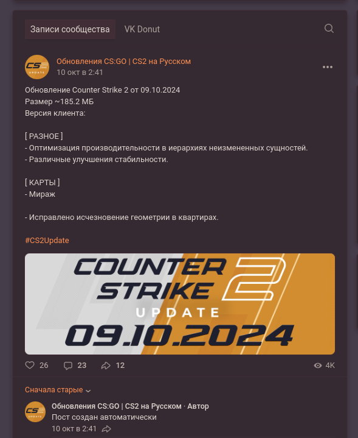

# GS 2 Updates Poster

This application allows to translate and re-post official Counter Strike 2 (and previously CS:GO) news to VKontakte, Telegram and Discord. Also it automaticly creates two images - one for the posts header and one for the `Stories`, then the app uploads and links them. Once the post is created, the custom comment can be added.

In sources you can also find currency parser script, probably it will be included into main script.

The app was made for [Обновления CS:GO | CS2 на Русском](https://vk.com/csgoupdate).

## Screenshots



## Setup

Requirements

- Windows 10
- Python 3.10

Installation

```
pip install -r requirements.txt
```

Run

```
start.bat
```

## Configure

I will not give instructions how to fully configure it, because this bot was made specially for [Обновления CS:GO | CS2 на Русском](https://vk.com/csgoupdate) VK group and I don't allow anybody to use it other than me.

Fill the `config.yaml` file.

## TODO

- [ ] update requirements.txt
- [ ] put config into separate folder or make properties as environment variables
- [ ] docker